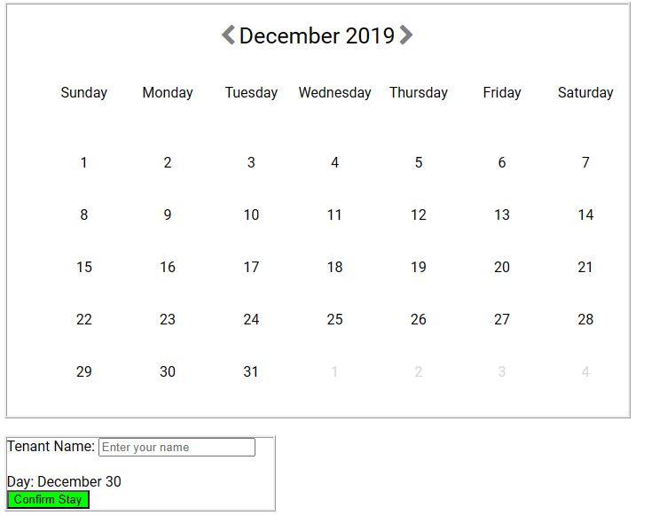
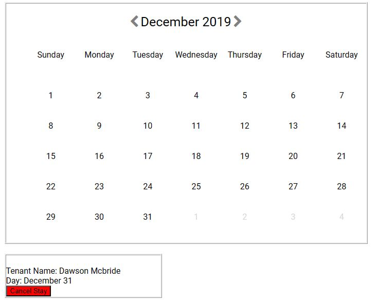

# Calendar Scheduler

## Setup
1) Run npm install to install modules
2) Run npm start

## How to use the Application

1) Click on the arrows to change the months.
2) Click on the date of the current month to reserve a slot.
   
3) The box will not go away until you have filled it.
4) Name cannot be empty.
5) After clicking on confirm stay, the box will disappear and you can see your reservation when  you click on the date again
6) After clicking on a date with a reserved slot, you will now have the option to cancel your stay by clicking on the button.

7) If a slot is booked or removed from another instance, a popup will appear to notify about it.
